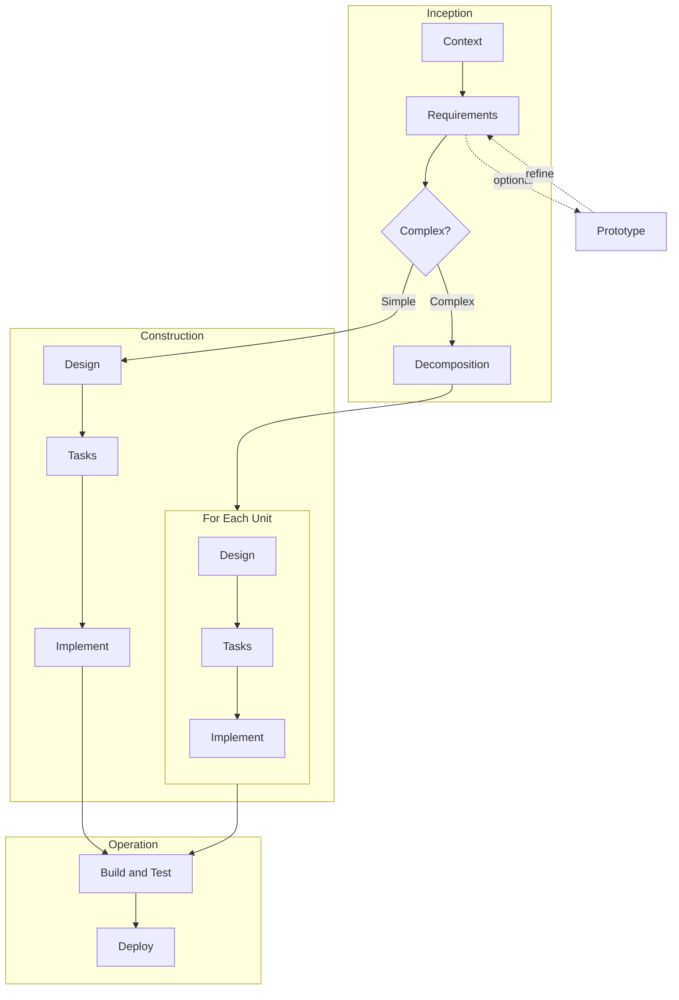

# AI-DLC — AI Development Lifecycle Skills

A structured, decision-driven workflow for AI-assisted software development. AI-DLC guides projects from initial context assessment through requirements, design, task planning, and implementation — with built-in decision gates, validation rules, and audit trails at every phase.

## Why AI-DLC

AI coding assistants are powerful but undirected. Without structure, they produce inconsistent architectures, skip edge cases, and make technology choices that don't align with your project. AI-DLC solves this by introducing a lightweight lifecycle that keeps the AI focused and the human in control.

- **Decision gates** at each phase surface the right questions and validate answers for conflicts before moving forward
- **Manifest-based state tracking** lets you pause, resume, and roll back across sessions
- **Incremental delivery** for complex projects — decompose into units, design and implement one at a time
- **Parallel implementation** via sub-agents with file ownership isolation
- **Multi-platform** — works on Kiro, Claude Code, Cursor, and Windsurf

## Quick Start

### Installation

Clone the repo and copy the skills into your project's platform-specific directory:

```bash
git clone <repo-url> aidlc-skills
cd aidlc-skills
```

**Kiro:**
```bash
cp -r skills/aidlc* /path/to/your/project/.kiro/skills/
```

**Claude Code:**
```bash
cp -r skills/aidlc* /path/to/your/project/.claude/skills/
```

**Cursor:**
```bash
cp -r skills/aidlc* /path/to/your/project/.cursor/skills/
```

**Windsurf:**
```bash
cp -r skills/aidlc* /path/to/your/project/.windsurf/skills/
```

#### Optional: Install as Kiro Power

For Kiro users, you can also install the AI-DLC power for documentation and keyword-based skill discovery:

1. Open the **Powers** panel (click the Powers icon in the sidebar, or use Command Palette → "Powers: Open Panel")
2. Click **"Add Custom Power"**
3. Select **"Import power from a folder"**
4. Navigate to and select the `powers/aidlc` folder from this repo

The power adds discoverability through the Powers panel — the skills themselves still need to be copied into each project.

### Your First Feature

Just tell the AI what you want to build:

```
/aidlc build a todo app with user authentication, task management, and notifications
```

Or point it to an existing requirements document:

```
/aidlc build the application described in docs/requirements.md
```

The workflow kicks off automatically — scanning your workspace, generating specs, and guiding you through each phase with decision gates.

### Available Commands

Once the `aidlc` skill is active, you can say:

| Command | What It Does |
|---|---|
| `start` | Begin a new feature specification |
| `resume` | Pick up where you left off |
| `status` | Show current workflow progress |
| `next` | Continue to the next phase |
| `rollback` | Go back to a previous phase |
| `repair` | Rebuild manifest from disk artifacts |
| `quick` | Single-pass spec for simple brownfield features |
| `doctor` | Verify installation health and cross-references |
| `prototype` | Build a throwaway spike to validate requirements |
| `review` | Run solutions review or code review |
| `reverse-engineer` | Deep codebase analysis (13 reports) |
| Phase names | Jump directly: `context`, `requirements`, `design`, `tasks`, `implement`, `build`, `deploy` |

> **Note**: `units` and `decomposition` refer to the same phase — both commands work interchangeably.

## Phases

AI-DLC organizes the development lifecycle into three phases:

| Phase | Covers | Skills |
|---|---|---|
| **Inception** | Understanding the problem space — context assessment, requirements gathering, and decomposition into deliverable units | aidlc-context, aidlc-requirements, aidlc-decomposition |
| **Construction** | Solving the problem — technology decisions, detailed design, task planning, and code implementation | aidlc-design, aidlc-tasks, aidlc-implement |
| **Operation** | Shipping and running — final integration verification, CI/CD pipeline generation, and deployment | aidlc-build, aidlc-deploy |

## Workflow Overview



**Simple projects** skip decomposition — go straight from requirements to design, then implement, build and test, and deploy.

**Complex projects** (5+ stories, 2+ domains) decompose into units (including a foundation unit for shared scaffolding when needed), then design and implement each unit independently before building, testing, and deploying.

**Build and Test** verifies the implemented code compiles, passes tests, and meets quality gates. Note that unit tests and local builds typically happen within implementation tasks — this stage represents the final integration verification that everything works together across units and environments.

**Deploy** pushes the verified build to the target environment. This is the release gate — infrastructure provisioning, environment promotion, or artifact publishing.

**Prototypes** are standalone side-quests — throwaway code to validate ideas before committing to a full design cycle.

## Skills Reference

### Core Workflow (in order)

| Skill | AIDLC Phase | Stage | What It Does |
|---|---|---|---|
| `aidlc-context` | Inception | 1 | Scans workspace, detects stack and architecture (brownfield) or captures intent (greenfield). Produces `context.md` and steering files. Creates the manifest. |
| `aidlc-requirements` | Inception | 2 | Translates context into user stories with EARS acceptance criteria. Generates personas (optional). Routes to decomposition, design, or prototype based on complexity. |
| `aidlc-decomposition` | Inception | 3 | Breaks requirements into independently deliverable units using DDD concepts. Defines boundaries, dependencies, and development sequence. Proposes a foundation unit for shared scaffolding when needed. Presents incremental vs. comprehensive mode choice. |
| `aidlc-design` | Construction | 4 | Makes technology decisions via D3 decision gate. Generates component design, data model, API spec, integration patterns, and implementation plan. Supports compact (≤10 stories) and modular (11+) formats. |
| `aidlc-tasks` | Construction | 5 | Breaks design into sequenced, estimable tasks. Generates execution waves with file ownership for parallel dispatch. |
| `aidlc-implement` | Construction | 6 | Executes tasks in standard (one-at-a-time), parallel (wave-based sub-agents), or autonomous (all waves, no stops) mode. |
| `aidlc-build` | Operation | 7 | Detects build tooling, runs final integration build, executes full test suites, validates quality gates (lint, type-check, security, coverage). Produces build report. |
| `aidlc-deploy` | Operation | 8 | Generates CI/CD pipeline configs via D5 decision gate. Handles environment promotion, secrets management, rollback strategy, and deployment scripts. |

### Supporting Skills

| Skill | What It Does |
|---|---|
| `aidlc-reverse-engineer` | Deep brownfield codebase analysis. Extracts architecture, modules, data models, API surface, business rules, features, integrations, conventions, and technical debt. Output is project-scoped (`.aidlc/reverse-engineer/`) and shared across all features. |
| `aidlc-prototype` | Builds a throwaway spike to validate requirements. No architecture, no tests, hardcoded data. Code goes to `.aidlc/prototype/`. |
| `aidlc-solutions-review` | Cross-unit design review. Compares 2+ unit designs for architectural conflicts, technology mismatches, integration gaps, and duplication. |
| `aidlc-code-review` | Reviews implemented code against design specs, security best practices, performance, test coverage, and coding standards. Produces severity-classified findings with suggested fixes. |
| `aidlc` | Workflow orchestrator. Reads manifest state, dispatches to phase skills by loading their SKILL.md, manages rollback and status display. One activation drives the entire workflow. |

## Decision Gates

Each phase has a decision gate that generates targeted questions, validates answers for conflicts, and ensures alignment before proceeding.

| Gate | Phase | Covers |
|---|---|---|
| D1 | Requirements | Feature scope, user types, core functionality, data entities, integrations, business rules, constraints |
| D2 | Decomposition | Architecture pattern, decomposition strategy, unit proposals, dependencies, development sequence |
| D3 | Design | Technology stack, frameworks, data layer, testing strategy, infrastructure, code organization |
| D4 | Tasks | Breakdown strategy, implementation approach (TDD/test-after), component priority, integration strategy, task granularity |
| D5 | Deploy | CI/CD platform, deployment target, deployment strategy, environments, promotion, secrets management, rollback, monitoring |

### How Decision Gates Work

1. The skill generates a decisions file with questions tailored to your project context
2. You fill in answers (or say "use recommendations" to auto-fill)
3. The skill validates for conflicts — e.g., "Enterprise scope with solo developer" or "Microservices with shared database"
4. Conflicts are classified by severity (🔴 Critical, 🟡 Major, 🟢 Minor) with resolution options
5. After resolution, the skill proceeds to generation

## Artifacts

AI-DLC produces artifacts at conventional paths. All paths are platform-aware.

### Spec Artifacts (`{SPECS_DIR}/{feature}/`)

| File | Produced By | Description |
|---|---|---|
| `context.md` | aidlc-context | Project landscape, stack, architecture, feature impact |
| `requirements.md` | aidlc-requirements | User stories with EARS acceptance criteria |
| `personas.md` | aidlc-requirements | User personas (conditional) |
| `units.md` | aidlc-decomposition | Unit boundaries, dependencies, development sequence |
| `design.md` | aidlc-design | Architecture overview and design summary |
| `design/components.md` | aidlc-design | Component breakdown |
| `design/data-model.md` | aidlc-design | Entity definitions, schemas, relationships |
| `design/api-spec.md` | aidlc-design | Endpoint specifications |
| `design/integration.md` | aidlc-design | External service and inter-unit integration |
| `design/implementation.md` | aidlc-design | Directory structure, conventions, project config |
| `design/correctness.md` | aidlc-design | Property-based testing properties (conditional) |
| `design/testing-strategy.md` | aidlc-design | Testing architecture, frameworks, coverage mapping (conditional) |
| `design/nfr.md` | aidlc-design | Non-functional requirements (conditional) |
| `tasks.md` | aidlc-tasks | Sequenced tasks with execution waves |

### Workflow Artifacts (`{WORKFLOW_DIR}/{feature}/`)

| File | Description |
|---|---|
| `aidlc-manifest.yaml` | Single source of truth for workflow state |
| `audit.md` | Chronological log of all actions taken |
| `decisions-{phase}.md` | Decision gate answers (one per phase that has a gate) |
| `architecture-review.md` | Solutions review findings |
| `code-review.md` | Code review findings |
| `build-report.md` | Build results, test results, quality gate status |
| `deploy-summary.md` | Deployment configuration summary |

Decision gate files are produced implicitly by each phase — they're not tracked in the manifest.

### Steering Files (`{STEERING_DIR}/`)

| File | Description |
|---|---|
| `product.md` | Product overview, target users, key features |
| `tech.md` | Technology stack, conventions, patterns |
| `structure.md` | Project directory structure and key files |
| `aidlc-workflow.md` | Workflow state reference for context recovery |
| `resources.md` | External resources (design tools, API specs, docs) |

### Path Variables

| Variable | Kiro | Claude Code | Cursor | Windsurf |
|---|---|---|---|---|
| `SPECS_DIR` | `.aidlc/specs` | `.aidlc/specs` | `.aidlc/specs` | `.aidlc/specs` |
| `STEERING_DIR` | `.kiro/steering` | `.claude/steering` | `.cursor/steering` | `.windsurf/steering` |
| `WORKFLOW_DIR` | `.aidlc/workflow` | `.aidlc/workflow` | `.aidlc/workflow` | `.aidlc/workflow` |

## Implementation Modes

The implementation skill offers three modes:

### Standard Mode
Tasks executed one at a time. You review and approve after each task. Best for learning the codebase or when you want tight control.

### Parallel Mode
Tasks grouped into dependency waves. Each wave dispatches one sub-agent per phase. Phases within a wave run simultaneously with isolated file ownership. You review after each wave.

- Requires Kiro Autopilot mode or Claude Code
- Not available on Cursor/Windsurf

### Autonomous Mode
All waves executed without stopping. Failed tasks retry up to 5 times, then get skipped. Tasks depending on failed tasks are also skipped. You get a single summary at the end.

- Same platform requirements as parallel mode
- Best when you trust the spec fully

## Incremental vs. Comprehensive

After decomposition, you choose a delivery mode:

**Comprehensive** — A single design covering all units. Best for tightly coupled units or small projects. Workflow: design → tasks → implement (all at once).

**Incremental** — Design, task, and implement one unit at a time. Recommended for 2+ units.
- The decomposition skill proposes a foundation unit (first in sequence) when shared scaffolding is needed
- Workflow: (select unit → design → tasks → implement) × N

In incremental mode, each unit gets its own scoped directory (`{SPECS_DIR}/{feature}/units/{unit}/`) with its own design docs and tasks.

## Extending AI-DLC

### Steering Files

Steering files in `{STEERING_DIR}/` provide persistent context across all interactions. They're created by the context skill and updated by downstream phases. You can also edit them manually to inject team standards, coding conventions, or project-specific guidance.

## Skill Anatomy

Each skill follows a layered structure optimized for token efficiency:

```
aidlc-{name}/
├── SKILL.md          # Compact index — identity, activation, info contract, process table
├── actions/          # Detailed action instructions (loaded on demand, not upfront)
│   ├── decision-gate.md
│   └── generate.md
├── assets/           # Output templates (schema-style, loaded during generation)
│   ├── decision-gate.md
│   └── {output-template}.md
└── references/       # Reference material loaded conditionally
    ├── {catalog}.md
    └── {guide}.md
```

Additionally, shared patterns live inside the orchestrator:

```
aidlc/
├── SKILL.md          # Orchestrator index
├── actions/          # Orchestrator actions (routing, status, rollback, etc.)
└── shared/
    ├── base.md       # Environment detection, manifest ops, behavioral rules, audit format
    └── decision-gate.md  # Output template for all decision files
```

- `SKILL.md` is a compact index (~100-140 lines) that the orchestrator loads on dispatch. It contains identity, activation, quick start, info contract, initialization, and a process table pointing to action files.
- `actions/` contains detailed procedural instructions loaded only when executing that specific step — not all upfront.
- `assets/` contains schema-style templates that define *what to include* in generated artifacts (the model knows markdown formatting — templates specify content structure).
- `references/` contains supplementary material loaded conditionally — technology catalogs, validation rules, architecture guides.
- `aidlc/shared/base.md` is loaded once per session and provides common operations shared across all skills.

## Context Recovery

Every skill includes a context recovery mechanism. If the AI's context window is compacted mid-phase:

1. Read `{STEERING_DIR}/aidlc-workflow.md` for the manifest path
2. Read the manifest for current phase and artifact paths
3. Read the skill's `SKILL.md` to reload instructions
4. Resume from the current action

The manifest and audit trail provide enough state to pick up where you left off.

## Manifest Schema (v2.2)

The manifest uses a compact phase-grouped format. Artifacts are grouped by the phase that produced them, not by individual file.

```yaml
version: "2.2"
feature: "notifications"
language: "en"
platform: "kiro"
created: "2026-04-15T10:00:00Z"
updated: "2026-04-15T11:30:00Z"

state:
  sharedPhases: [context, requirements, decomposition]
  mode: incremental              # null | incremental | comprehensive
  status: active                 # active | completed
  implementationMode: null       # null | standard | parallel | autonomous (comprehensive mode only)
  quickPath: false               # true if created via quick mode

# Top-level implementation tracking (comprehensive mode only; incremental uses units[].implementation)
implementation:
  totalTasks: 0
  completedTasks: 0
  currentTask: null
  currentWave: null

artifacts:
  context:
    status: approved
    timestamp: "2026-04-15T10:00:00Z"
    files: [context.md]
  requirements:
    status: approved
    timestamp: "2026-04-15T10:30:00Z"
    files: [requirements.md, personas.md]
  decomposition:
    status: approved
    timestamp: "2026-04-15T11:00:00Z"
    files: [units.md]
  # Comprehensive mode also has: design, tasks, build, deploy (same structure)

context-summary:
  type: Greenfield
  stack: "TypeScript / NestJS / PostgreSQL"
  architecture: "Modular Monolith"
  feature: "E-commerce platform"
  impact: "New standalone"
  complexity: High
  teamSize: small                # solo | small | medium | large — captured in D1
  recommendations: { personas: true, units: true, nfr: true }

decisions:
  requirements: { scope: "Full product", user-types: 3, integrations: 2 }
  decomposition: { strategy: "domain-driven", units: 3 }
  # Comprehensive mode also has: design, tasks, deploy (same structure)

steering:
  updatedBy:
    product: [context, requirements]
    tech: [context, design]
    structure: [context, design]

units:
  - name: auth
    status: in-progress
    phase: implement
    completedPhases: [design, tasks]
    implementationMode: standard
    implementation: { totalTasks: 12, completedTasks: 8, currentTask: "3.2", currentWave: null }
    artifacts:
      design: { status: approved, timestamp: "...", files: [design.md, design/components.md] }
      tasks: { status: approved, timestamp: "...", files: [tasks.md] }
    decisions:
      design: { api-style: "REST", database: "PostgreSQL" }
      tasks: { breakdown: "vertical-slice", testing: "test-after" }
  - name: notifications
    status: in-progress
    phase: design
    completedPhases: []
    implementationMode: null
    implementation: { totalTasks: 0, completedTasks: 0, currentTask: null, currentWave: null }
    artifacts:
      design: { status: draft, timestamp: "...", files: [design.md] }
    decisions:
      design: { api-style: "REST" }
  - name: payments
    status: not-started
    phase: null
    completedPhases: []
    implementationMode: null
    implementation: { totalTasks: 0, completedTasks: 0, currentTask: null, currentWave: null }
    artifacts: {}
    decisions: {}
```

Conventions:
- **Shared vs. per-unit**: `state.sharedPhases` tracks project-wide phases. Per-unit phases live in `units[].phase` and `units[].completedPhases`.
- **Parallel units**: Multiple units can be `in-progress` simultaneously — different sessions work on different units.
- **Comprehensive mode**: `units[]` stays empty. Design/tasks/implement tracked in `state.sharedPhases`. Implementation mode stored in `state.implementationMode`. Task progress tracked in top-level `implementation`.
- File paths in `files` are relative to `{SPECS_DIR}/{feature}/` (shared) or `{SPECS_DIR}/{feature}/units/{unit}/` (per-unit)
- Decision gate files (`decisions-{phase}.md`) are implicit — not tracked in artifacts
- Steering paths are implicit (`{STEERING_DIR}/{name}.md`) — only `updatedBy` is tracked
- `context-summary` stores key fields from context.md for downstream skills. `teamSize` is captured in D1 and used by D2/D3 validation rules.
- `decisions` stores compact summaries — shared decisions at top level, unit-scoped in `units[].decisions`

## License

This project is licensed under the MIT-0 (MIT No Attribution) License. See [LICENSE.md](LICENSE.md) for details.

## Contributing

We welcome contributions. See [CONTRIBUTING.md](CONTRIBUTING.md) for guidelines on reporting bugs, submitting pull requests, and our code of conduct.
