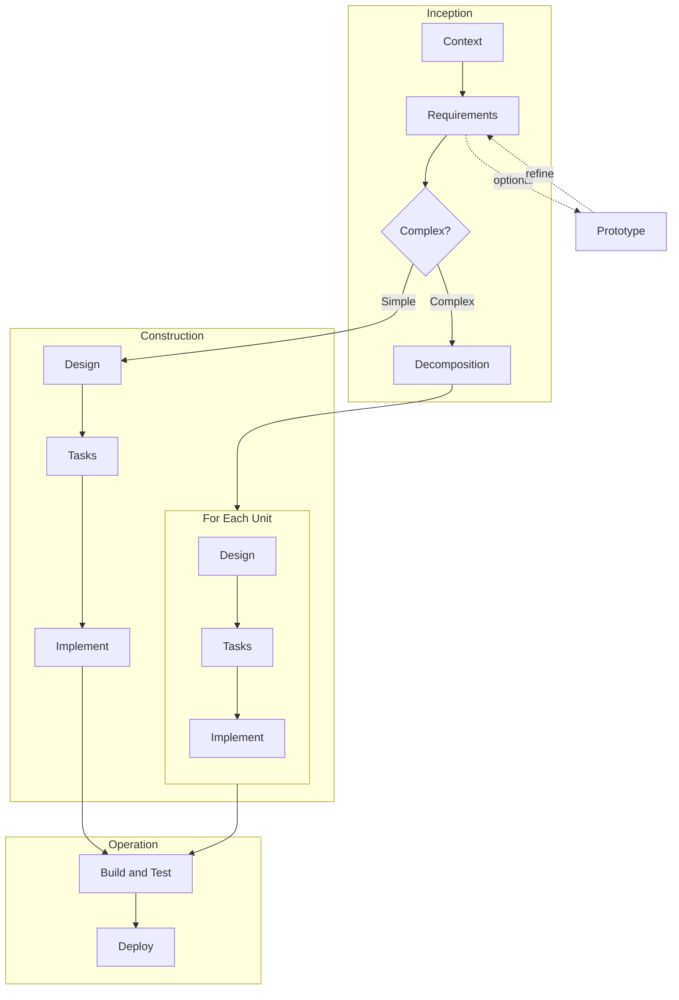

# AI-DLC — AI Development Lifecycle Skills

[](CHANGELOG.md)
[](LICENSE.md)

An opinionated implementation of the [AI-DLC (AI-Driven Development Life Cycle)](https://prod.d13rzhkk8cj2z0.amplifyapp.com/) methodology as a portable skill harness for AI coding assistants.

This project implements AIDLC principles — decision-driven phases, manifest-based state, and human-in-the-loop control — with a focus on **portability** and **simplicity**. Skills are plain markdown files that work across platforms without runtime dependencies, custom tooling, or platform lock-in.

For the official AIDLC workflow definitions maintained by AWS, see [awslabs/aidlc-workflows](https://github.com/awslabs/aidlc-workflows). For a detailed comparison, see [docs/comparison.md](docs/comparison.md).

## Why AI-DLC

AI coding assistants are powerful but undirected. Without structure, they produce inconsistent architectures, skip edge cases, and make technology choices that don't align with your project. AI-DLC introduces a lightweight lifecycle that keeps the AI focused and the human in control.

- **Decision gates** at each phase surface the right questions and validate answers before moving forward
- **Traceability** enforced across the full chain — requirements → design → tasks → build verification
- **Manifest-based state tracking** lets you pause, resume, and roll back across sessions
- **Scope-adaptive workflow** — auto-detects if you're building a new project, adding a feature, fixing a bug, refactoring, or rewriting a legacy system (with enforced functional parity)
- **Incremental delivery** for complex projects — decompose into units, design and implement one at a time
- **Parallel implementation** via sub-agents with file ownership isolation
- **Learning loop** — human corrections persist as project rules for future workflows
- **Multi-language** — all artifacts and responses generated in the user's language
- **Multi-platform** — works on Kiro (IDE and CLI) and Claude Code

## Quick Start

### Installation

Clone the repo and copy the skills into your project:

```bash
git clone <repo-url> aidlc-skills
cd aidlc-skills
```

**Kiro (IDE or CLI):**
```bash
cp -r skills/aidlc* /path/to/your/project/.kiro/skills/
```

**Claude Code:**
```bash
cp -r skills/aidlc* /path/to/your/project/.claude/skills/
```

#### Optional: Install as Kiro Power

1. Open the **Powers** panel (Command Palette → "Powers: Open Panel")
2. Click **"Add Custom Power"** → **"Import power from a folder"**
3. Select the `powers/aidlc` folder from this repo

### Your First Feature

Just tell the AI what you want to build:

```
/aidlc build a todo app with user authentication, task management, and notifications
```

Or point it to an existing requirements document:

```
/aidlc build the application described in docs/requirements.md
```

Try one of the [example requirements](examples/requirements/) included in this repo:

```
/aidlc build the application described in examples/requirements/requirements-en-art-toys.md
```

### Available Commands

| Command | What It Does |
|---|---|
| `start` | Begin a new feature specification |
| `resume` | Pick up where you left off |
| `status` | Show current workflow progress |
| `next` | Continue to the next phase |
| `rollback` | Go back to a previous phase |
| `repair` | Rebuild manifest from disk artifacts |
| `quick` | Single-pass spec for simple brownfield features |
| `doctor` | Verify installation health |
| `adapt` | Generate the current platform's entry point after switching platforms |
| `upgrade` | Migrate an old-layout project to the current blueprints structure |
| `scope [name]` | Change workflow scope (new/feature/bugfix/refactor/rewrite) |
| `prototype` | Build a throwaway spike to validate requirements |
| `review` | Run solutions review or code review |
| `reverse-engineer` | Deep codebase analysis (13 reports; + parity baseline in rewrite scope) |
| Phase names | Jump directly: `context`, `requirements`, `design`, `tasks`, `implement`, `build`, `deploy` |

> **Note**: `units` and `decomposition` refer to the same phase — both work interchangeably.

## Workflow Overview

AI-DLC organizes the development lifecycle into three stages:

| Stage | Covers | Skills |
|---|---|---|
| **Inception** | Context assessment, requirements, decomposition into units | aidlc-context, aidlc-requirements, aidlc-decomposition |
| **Construction** | Technology decisions, design, task planning, implementation | aidlc-design, aidlc-tasks, aidlc-implement |
| **Operation** | Build verification, CI/CD pipeline generation, deployment | aidlc-build, aidlc-deploy |

### Scope-Adaptive Workflow

The workflow adapts to your task. Scope is auto-detected from your request and workspace, or you can set it manually with `scope [name]`.

| Scope | Phases | Best For |
|---|---|---|
| `new` | All phases | New projects, building from scratch |
| `feature` | All phases | Adding capability to existing code |
| `bugfix` | Context → Requirements → Design → Tasks → Implement → Build | Fixing specific bugs (skips decomposition, deploy) |
| `refactor` | Context → Design → Tasks → Implement → Build | Restructuring code (skips requirements, decomposition, deploy) |
| `rewrite` | All phases + mandatory Reverse-Engineer after context | Rebuilding a legacy system on a modern stack with functional parity — see [docs/rewrite-parity.md](docs/rewrite-parity.md) |



**Simple projects** go straight from requirements to design → implement → build → deploy.

**Complex projects** (5+ stories, 2+ domains) decompose into units, then design and implement each independently before building and deploying.

### Key Behaviors

**Traceability**: Every phase must account for upstream items. Design traces to requirements, tasks trace to design components, and the build phase verifies end-to-end coverage. Gaps must be documented with justification.

**Human-in-the-loop (incremental mode)**: After each unit phase (design, tasks, implement), control returns to the Unit Dashboard. The user decides what to work on next — not the workflow. Decision gates (D3, D4) are always fresh per unit.

**Learning loop**: When the user corrects an artifact and the correction represents a general rule, the workflow asks whether to remember it. Accepted corrections are stored in `corrections.md` and loaded in all future sessions.

**Session recovery**: On resume after a session break, the orchestrator re-reads the manifest, re-loads all templates from disk, and dispatches the correct skill. No artifacts are generated from memory.

**Language**: All artifacts and responses are generated in the user's detected language. Only code, file paths, YAML keys, and technical terms stay in English.

**Context rot prevention**: Long sessions can cause instruction drift where the agent skips checkpoints. AI-DLC mitigates this primarily with behavioral anchors in the platform shim (`.kiro/steering/aidlc.md` or `.claude/CLAUDE.md`) that persist across the session, plus skill handoff identity resets at phase transitions. PreToolUse hooks are available as optional stricter enforcement on both Kiro and Claude Code. See [Context Rot](docs/context-rot.md) for details.

## Documentation

| Document | Description |
|---|---|
| [Comparison](docs/comparison.md) | How this differs from official AIDLC workflows |
| [Skills Reference](docs/skills-reference.md) | All skills — what they do, what they read/write |
| [Decision Gates](docs/decision-gates.md) | D1–D5 details, how they work, conflict validation |
| [Artifacts](docs/artifacts.md) | All generated files, paths, and platform variables |
| [Implementation Modes](docs/implementation-modes.md) | Standard, parallel, autonomous; incremental vs comprehensive |
| [Manifest Schema](docs/manifest-schema.md) | v1.0.0 manifest format with full YAML example |
| [Skill Anatomy](docs/skill-anatomy.md) | How skills are structured, extending AI-DLC |
| [Developing Skills](docs/developing-skills.md) | Step-by-step guide to creating a new skill |
| [Context Recovery](docs/context-recovery.md) | How resume and session recovery works |
| [Context Rot](docs/context-rot.md) | Instruction drift in long sessions — prevention and recovery |

## Examples

| Example | Description |
|---|---|
| [Todo App](examples/todo-app/) | Complete workflow output — all artifacts from a simple project |
| [Example Requirements](examples/requirements/) | Business requirements in English and Thai for testing |

## Resources

| Resource | Description |
|---|---|
| [AI-DLC Whitepaper](https://prod.d13rzhkk8cj2z0.amplifyapp.com/) | Methodology overview and design principles |
| [AI-DLC Workflows](https://github.com/awslabs/aidlc-workflows) | Official AIDLC workflow definitions |

## License

This project is licensed under the MIT-0 (MIT No Attribution) License. See [LICENSE.md](LICENSE.md) for details.

## Contributing

We welcome contributions. See [CONTRIBUTING.md](CONTRIBUTING.md) for guidelines.
